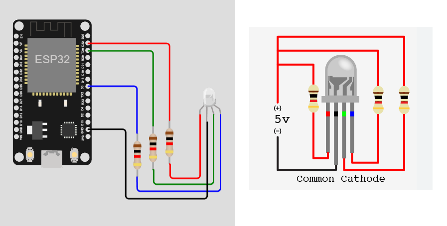

# Simple Blink with RGB Led
Hi there! I'm creating here a simple Blink, for this project you'll require the following material:

* 1 NodeMCU ESP8266
* 1 common catode RGB Led
* 3 resistors (330ohms)

Here is the simple circuit, with the loop code the blink will be active for 3s and inactive for 3s

