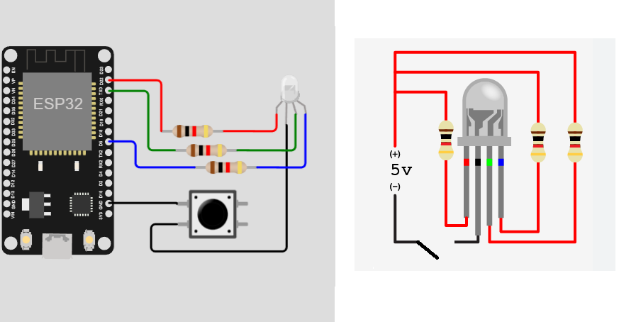

# Simple Blink with RGB Led and push button
Hi there! I'm creating here a simple cicuit with a switch interruptor, for this project you'll require the following material:

* 1 NodeMCU ESP8266
* 1 common catode RGB Led
* 1 push button
* 3 resistors (330ohms)

Here is the simple circuit, the code starts with status 0 wich means off then, by pulsing the button
the status will increment by 1, changing the values for the RGB Led, when the status reach the maximum combinations
(in this case 4) the status will return to value 0

